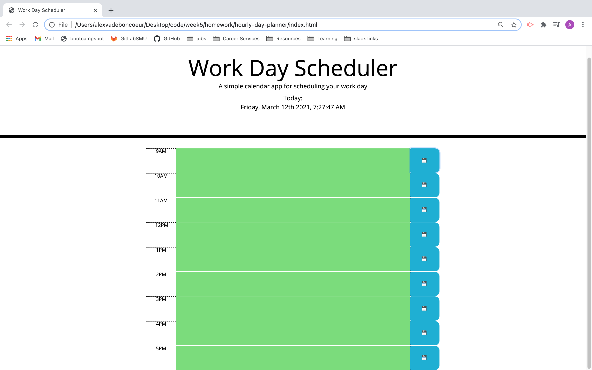
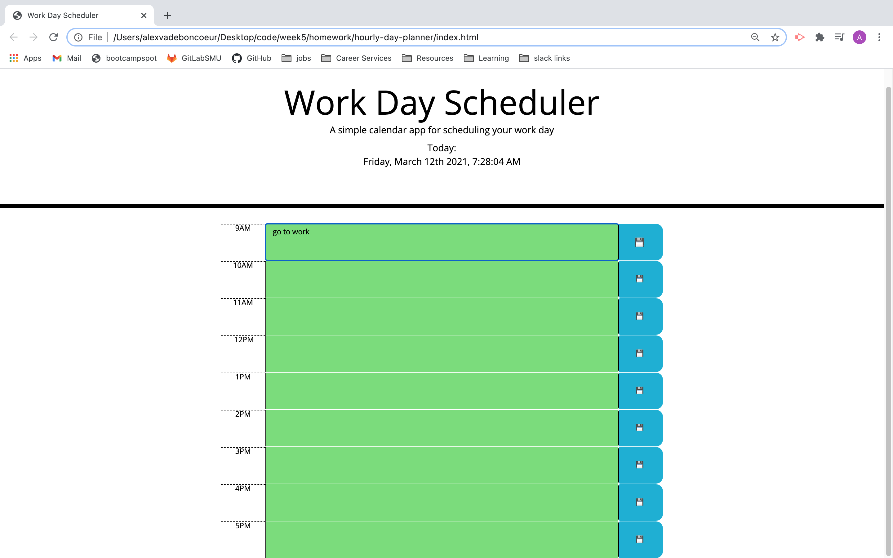
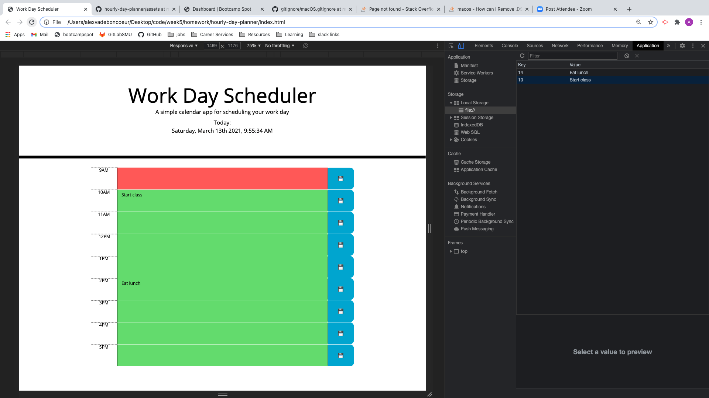
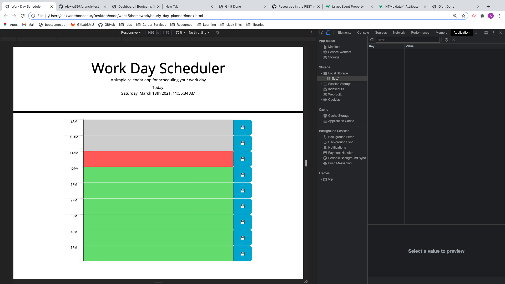
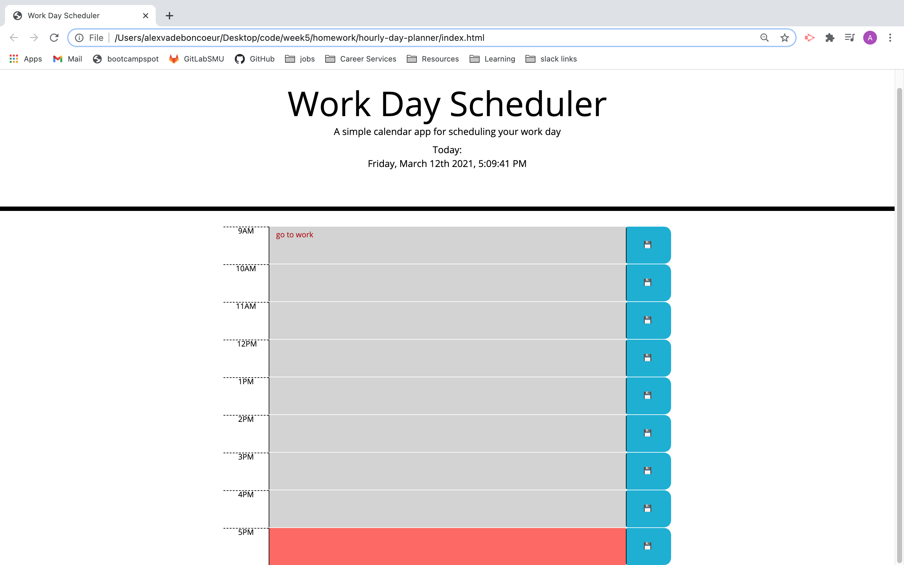

# hourly-day-planner

[Plan Your Workday Here.](https://alexva397.github.io/hourly-day-planner/)

The Hourly day planner is designed to help the user keep track of their tasks on the given day.

The user is given a current time display in the header to reference when planning their day.

The site is structured with an hour slot for each hour in a standard business day. *9AM-5PM*
- The current hour is displayed in red.
- Upcoming hours are displayed in green.
- Past hours are displayed in grey.

When the user inputs text to the text area and saves with the corresponding save button, the task is saved to User local storage.

If the user leaves or refreshes the page, their tasks remain within the correct time slot.

The user can delete the text from each time slot and click the save button to remove a task.

- - - 

## Screenshots

